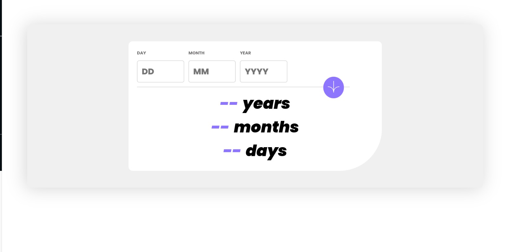

# Age Calculator

### Descrição

Participei do desafio da plataforma Frontend Mentor, onde desenvolvi uma calculadora de anos vividos utilizando JavaScript. Nesta aplicação, o usuário insere sua data de nascimento e o JavaScript realiza o cálculo para determinar quantos anos ele viveu até o momento. Além disso, aproveitei a oportunidade para aprimorar minhas habilidades de estilização utilizando Sass, tornando a interface mais atraente e responsiva. Link do desafio: https://www.frontendmentor.io/challenges/age-calculator-app-dF9DFFpj-Q

##### Técnologias Utilizadas

    
    
    
    

##### Contatos: 

    
    

